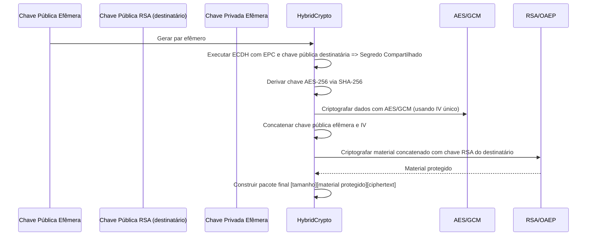

# CryptoService - Microserviço de Criptografia Híbrida para Redes P2P

## Visão Geral

O **CryptoService** é um microserviço desenvolvido em Java 21 com Spring Boot 3.4, projetado para atuar como a camada de criptografia em uma rede de comunicação ponto a ponto (P2P) com criptografia end-to-end.  
Esta solução implementa um esquema híbrido que combina criptografia de curva elíptica (EC) e RSA, realizando operações de assinatura, verificação, criptografia e descriptografia robustas. O sistema segue padrões modernos de desenvolvimento, utilizando Clean Architecture, princípios SOLID, TDD (Test-Driven Development) e o padrão Repository, além de utilizar Redis para cache e mensageria.

---

## Arquitetura do Projeto

O projeto está organizado em camadas, cada uma com responsabilidades bem definidas:

### 1. Domínio
- **Entidades e Records:**  
  - `HybridKeyPair`: Agrupa o par de chaves gerado (EC e RSA).  
  - `HybridSignature`: Contém as assinaturas geradas pelos algoritmos de EC e RSA.  
  - `CryptoOperation`: Representa as operações criptográficas solicitadas (ex.: ENCRYPT, DECRYPT, SIGN, VERIFY, GENERATE_KEYS).

- **Lógica Criptográfica:**  
  - `HybridCrypto`: Classe utilitária que implementa os algoritmos para geração de chaves, assinatura/ verificação, criptografia/ descriptografia e encapsula os procedimentos criptográficos.

### 2. Aplicação
- **DTOs:**  
  - `CryptoOperationRequest` e `CryptoOperationResponse` – usados para comunicação entre o cliente e o serviço, com conversão dos dados binários para Base64.
  
- **Serviço:**  
  - `CryptoService` e sua implementação `HybridCryptoService` orquestram as operações criptográficas, integrando os componentes de domínio, repositório, cache e mensageria.
  
- **Retry & Tratamento de Erros:**  
  - `RetryPolicy`: Implementa uma lógica de retry com backoff exponencial para operações suscetíveis a falhas transitórias.  
  - `GlobalExceptionHandler`: Centraliza o tratamento de exceções usando o padrão @RestControllerAdvice e garante respostas HTTP padronizadas.

### 3. Infraestrutura
- **Persistência:**  
  - `KeyRepository`: Interface que define as operações de armazenamento e recuperação de chaves, facilitando a substituição da implementação (ex.: para HSM ou KMS em produção).  
  - `InMemoryKeyRepository`: Implementação inicial usando memória, para fins de testes e desenvolvimento.

- **Cache e Mensageria:**  
  - **Cache:** `RedisKeyCache` utiliza Redis para armazenar os pares de chaves com duas camadas de TTL (curto e longo) para proteger dados sensíveis.  
  - **Mensageria:** `RedisMessageQueue` implementa uma fila de mensagens baseada no Redis para notificações assíncronas (por exemplo, após geração de chaves).

- **API REST:**  
  - `CryptoController`: Expõe os endpoints REST que recebem as requisições (em JSON) e retornam dados processados (em Base64), delegando a lógica para o serviço.

---

## Fluxo de Comunicação e Criptografia

### 1. Fluxo de Dados (P2P End-to-End)
  
```mermaid
flowchart TD
    A[Cliente P2P] -->|Solicita operação| B(CryptoController)
    B --> C(CryptoService)
    C --> D(HybridCrypto - Domínio)
    D --> E[KeyRepository / RedisKeyCache]
    C --> F[RedisMessageQueue]
    D -->|Operação Criptográfica| G[Resultado Criptográfico]
    G --> C
    C --> B
    B -->|Resposta (Base64)| A
```

#### Descrição:
- **Requisição:** O cliente envia uma solicitação (ex.: ENCRYPT, DECRYPT, SIGN, VERIFY, GENERATE_KEYS) para o controlador REST.
- **Processamento:** O serviço recupera ou gera as chaves necessárias via cache/repositório, executa a operação criptográfica e, se necessário, publica um evento na fila.
- **Resposta:** O resultado é retornado, com dados codificados em Base64 para compatibilidade com JSON.

### 2. Fluxo de Criptografia

#### Criptografia/Descriptografia


#### Assinatura/Verificação
- **Assinatura:** São geradas assinaturas com EC e RSA, após hash SHA-256 dos dados.
- **Verificação:** Ambas as assinaturas devem ser válidas para que a verificação seja considerada bem-sucedida.

---

## Tecnologias Utilizadas

- **Java 21 & Spring Boot 3.4:** Aproveitamento dos recursos modernos (records, APIs funcionais, injeção de dependências).
- **Redis:** Usado como cache (com dupla camada de TTL) e para mensageria.
- **JUnit 5, Mockito e MockMvc:** Ferramentas de teste para garantir alta cobertura (unitário e de integração).
- **Docker & Docker Compose:** Para containerização e orquestração do microserviço e do Redis.
- **SLF4J com Logback:** Para logging estruturado, centralizado e configurável.
- **Boas Práticas:** Clean Architecture, SOLID, Repository Pattern, TDD, retry com backoff exponencial e tratamento centralizado de erros.

---

## Cláusulas de Propriedade Intelectual

Este projeto e todo o seu código-fonte são de propriedade exclusiva da empresa sob CNPJ: 406.54.082.0001/02, e estão protegidos por direitos autorais. É **estritamente proibida** a reprodução, modificação ou distribuição deste código sem a devida autorização expressa do titular dos direitos.  
  
Caso você deseje utilizar ou adaptar partes deste projeto, certifique-se de obter a devida autorização e/ou seguir as diretrizes de licenciamento estabelecidas pelo autor. Todos os direitos são reservados.
O descumprimento do aviso previsto será passível de eventuais procedimentos legais.

---

## Containerização

### Dockerfile
```dockerfile
# Etapa de Build com Maven
FROM openjdk:21-ea-17-jdk as builder
WORKDIR /app
COPY mvnw .
COPY .mvn .mvn
COPY pom.xml .
RUN ./mvnw dependency:go-offline
COPY src src
RUN ./mvnw clean package -DskipTests

# Etapa Final – Execução
FROM openjdk:21-ea-17-jdk
WORKDIR /app
COPY --from=builder /app/target/cryptoservice.jar app.jar
EXPOSE 8080
ENTRYPOINT ["java", "-jar", "app.jar"]
```

### docker-compose.yml
```yaml
services:
  cryptoservice:
    build: .
    container_name: cryptoservice
    ports:
      - "8080:8080"
    depends_on:
      - redis
    environment:
      - SPRING_REDIS_HOST=redis
      - SPRING_REDIS_PORT=6379
  redis:
    image: redis:6.2
    container_name: redis
    ports:
      - "6379:6379"
    command: redis-server --appendonly yes
```

---

## Fluxogramas e Diagramas

### Diagrama de Arquitetura em Camadas
```mermaid
graph LR
    A[Cliente P2P] --> B[API REST (CryptoController)]
    B --> C[Serviço (HybridCryptoService)]
    C --> D[Domínio (HybridCrypto)]
    D --> E[KeyRepository / RedisKeyCache]
    C --> F[Mensageria (RedisMessageQueue)]
```

### Diagrama de Fluxo de Operação Criptográfica
```
flowchart TD
    subgraph CLIENT ["Cliente P2P - Requisições JSON com Base64"]
        A[Cliente P2P]
    end
    subgraph API ["API REST Layer - CryptoController"]
        B[CryptoController]
    end
    subgraph SERVICE ["Application Layer - HybridCryptoService, RetryPolicy, GlobalExceptionHandler"]
        C[HybridCryptoService]
        C1[RetryPolicy - Backoff Exponencial]
        C2[GlobalExceptionHandler - Tratamento de Erros]
    end
    subgraph DOMAIN ["Domain Layer - HybridCrypto e Records"]
        D[HybridCrypto]
        D1[Records: HybridKeyPair, HybridSignature, CryptoOperation]
    end
    subgraph INFRA ["Infrastructure Layer - KeyRepository, RedisKeyCache, RedisMessageQueue"]
        E[KeyRepository]
        F[RedisKeyCache - Cache com TTL Duplo]
        G[RedisMessageQueue - Fila de Mensagens]
    end

    A -->|Envio de requisição JSON Base64| B
    B -->|Mapeia DTOs e encaminha para serviço| C
    C -->|Recupera/gera chaves via| E
    C -->|Utiliza cache para chaves| F
    C -->|Executa operações criptográficas| D
    D -->|Utiliza| D1
    D -->|Retorna resultado criptográfico| C
    C -->|Publica evento de geração de chaves| G
    C -->|Implementa retry em falhas| C1
    C -->|Erros capturados globalmente| C2
    B -->|Retorna resposta JSON Base64| A
    E --- F
    F --- G

``